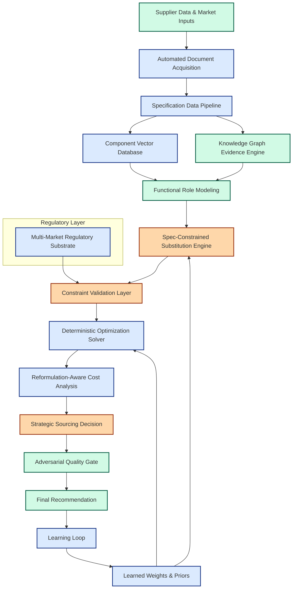

# Agnes: Sourcing Decision-Support for Supplement Raw Materials

  

**Built on the Spherecast challenge database.**

**Stack:** Python, LangGraph, Streamlit, SQLAlchemy, PubChem, OpenFDA

**Scope:** US & EU dietary supplements (Demoed via Vitamin C).

[Core Idea](#the-core-idea) · [Hero Scenario](#hero-scenario) · [Architecture](#architecture-three-reasoning-layers) · [Output](#output-tiered-candidate-groups) · [Key Learning](#key-learning) · [Vision](#vision-the-product-roadmap)

## The Core Idea
Most AI sourcing tools just pick the cheapest supplier and do not go further. Agnes does the opposite: it uses a three-layer reasoning system to produce **tiered candidate groups** and never makes up data it doesn't have.

Every claim is traceable. Critical documents like TDSs, CoAs, and GMO statements are rarely public. Agnes treats that as a real problem to solve, rather than ignoring it.

## Hero Scenario
A brand needs to swap out a key raw material (say, Vitamin C for an effervescent powder) because their current supplier is out of stock. A simple price comparison is not enough here. Agnes finds a substitute that is:
1. ⁠**Legally compliant** (e.g., US 21 CFR 111 + EU 2002/46/EC).
2. ⁠**Physically compatible** with the manufacturing process.
3. **Backed by verifiable evidence**.
4. **Strategically viable** (e.g., consolidating volume with an existing portfolio supplier).

---

## Architecture: Three Reasoning Layers

  

### Layer 1: Identity and Compliance (Deterministic Gate) using Domain Expert Annotation
An automated legal and chemical gate, nothing gets through without passing these checks.
- ⁠**Canonical Vocabulary:** Anchors ingredients to global registries (e.g., PubChem CID, CAS).
- ⁠**Legal Whitelists:** Rejects non-permitted chemical forms based on target market regulations.
- ⁠**Purity Thresholds:** Enforces pharmacopoeia standards (USP / Ph. Eur.) for assay percentages, heavy metals, and elemental impurities (per ICH Q3D).

### Layer 2: Evidence-Weighted Enrichment (The Epistemic Core)
Ranks candidates by how trustworthy their data actually is (e.g., Authoritative Registry = 0.95, Supplier Website = 0.70, LLM Inference = 0.20).
- **Contrapositive Inference:** Supplier documents are usually private, so Agnes infers raw material properties from Finished Goods (FG). If a tightly regulated CPG brand claims "Non-GMO" on their label, Agnes infers their mapped supplier provides a Non-GMO grade. Missing evidence counts as zero. It's never silently ignored.

### Layer 3: Strategic Reasoning (Business Logic)
Decides what to do with the verified data.
- **Country-Tier Scoring:** Uses calibrated priors from FDA/EU import alerts and export history to assess geographic risk, overridable by strong supplier-specific signals.
- **Consolidation Bonus:** Boosts scores for suppliers already used by other portfolio brands to improve MOQ and pricing leverage.
- **Substitution-Delta Risk:** Measures the real impact of a swap (e.g., switching from a crystalline to a coated form means costly reformulation; changing countries shifts tariff exposure).

---

## Output: Tiered Candidate Groups
Agnes groups results into tiers that match how procurement teams actually work. Every candidate carries a full reasoning trace and re-ranks automatically when variables change.
- **Preferred:** Clears all purity gates, has authoritative evidence, low country risk, and offers strategic consolidation.
- **Acceptable:** Passes legal gates but comes with minor strategic trade-offs (e.g., higher baseline country risk, offset by a strong individual track record).
- **Flagged:** Promising but missing critical private evidence. Queues the acquisition agent.
- **Unknown:** Could not provide a good decision based on the current evidences due to limited knowledge and information.

---

## Key Learning
 
During this project, we concluded the following points:
- Regulation and many documents does not change so much often, it is **better to use a document embedding database** to make query faster, more predictable, and cheaper. 
  - For embedding, we propose semantic embedding with section-based chunking, with Claude Haiku 4.5 as feature extractor and AWS Titan Embedding v2 as embedding model.
  - For vector storage, we propose using PostgreSQL with pgVector extension and tsvector for text searching.
- LLM usage with **Langgraph is a good middle ground** to provide a equivalent good result with fewer token usage than using Deepagents. However, **DeepAgents offers better flexibility** when faced with less predictable case, for example when data provided is not as complete as others.
- Since this task is an open-ended task, it is important to **limit agent loop**, such as tool usage, thinking, etc.
- Most of the **heavy lifting in this project comes from document outsourcing**, which are not publicly available. Given enough time to collect data, especially from manufacturer. Even with few data, our agent is able to query even complex information. 

We also face the following problems:

- We tried to use AWS OpenSearch as vector store, with the hope to have a managed service from AWS. However, the **setup is too complex** due to AWS IAM. We moved then to use a Postgres, which provides equivalent good result.
- **Most key decision documents are not publicly available**, such as technical sheets. Implementing this system is very easy, collecting the data is much harder. We suggest to use automated document acquisition agent, explained later. It is also worth it to allow user upload the document they collected from their supplier.

---

## Vision: The Product Roadmap

**Legend**
- 🟢 Green = Already implemented  
- 🟠 Orange = Partially implemented / evolving  
- 🔵 Blue = Vision / future components  

## Vision Flow Diagram

1. **Automated Document Acquisition Agent**  
   Automates the manual procurement loop. If a supplier is in the "Flagged Tier," an outreach agent drafts a context-aware email requesting missing TDS or CoA documents, parses the supplier’s response, extracts structured data, and updates the supplier profile. This enables a continuous **specification data pipeline**.

2. **Spec-Constrained Substitution Engine**  
   Moves beyond functional equivalence to enforce **quantitative compatibility**. Substitutions are validated deterministically against constraints such as purity, assay %, particle size, and form, ensuring real-world interchangeability.

3. **Component Vector Database**  
   Embeds ingredients based on multi-dimensional properties (chemical identity, specs, functional role). This enables fast similarity search, clustering, and scalable compatibility checks.

4. **Functional Role Modeling**  
   Represents ingredients by **formulation role** (active, excipient, stabilizer, etc.), preventing invalid substitutions and enabling context-aware reasoning across product types.

5. **Deterministic Linear Problem Solver**  
   Treats procurement as an optimization problem. Agnes constructs parameters (MOQ, capacity, lead time, price) and uses a linear solver to compute the optimal supplier configuration, enabling true **supplier economics optimization**.

6. **Full Knowledge-Graph Evidence Engine**  
   Expands inference into a multi-hop graph (Suppliers ↔ Raw Materials ↔ Finished Goods ↔ Certifications). Enables counterfactual reasoning and identification of missing high-impact evidence, while also surfacing cross-company demand patterns.

7. **Reformulation-Aware Substitution**  
   Shifts ranking from per-unit price to **Total Cost of Substitution** (price delta + reformulation overhead + market impact), reflecting real manufacturing constraints.

8. **Learned Weights & Priors**  
   Transitions evidence weighting and country risk scoring from static logic to machine-learned models trained on historical procurement outcomes.

9. **Multi-Market Regulatory Substrate**  
   Scales the system across global regulatory frameworks (FDA, EU, pharmacopoeia standards), enabling compliant sourcing decisions in any market.

10. **Adversarial Quality Gate**  
    Introduces a verification sub-agent that challenges reasoning outputs, identifies weak logic, and strengthens decision robustness. Typically, a single adversarial pass is sufficient.
---
*Sources & Acknowledgements:* Database and framing by Spherecast. Canonical chemistry via PubChem (NIH). Regulatory thresholds cross-verified against EUR-Lex, EDQM, FDA, and public supplier TDSs. Risk priors informed by FDA Import Alerts and EU RASFF.

*Team:* Yudhis, Sebastian, Heona, Janet, Si-Hoon
